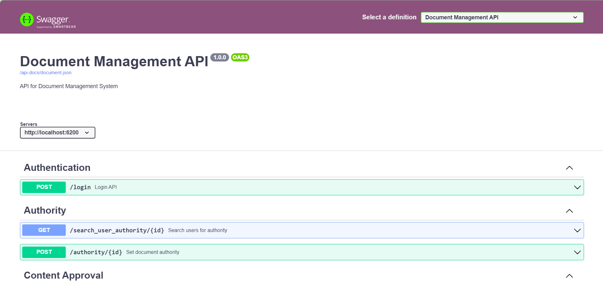

_Vietnamese below_
# Swagger in Odoo17

## Module structure
```
📁 base_rest
  📁 apispec
    📄 base_rest_service_apispec.py
    📄 restapi_method_route_plugin.py
    📄 rest_method_param_plugin.py
    📄 rest_method_security_plugin.py
    📄 __init__.py
  📁 components
    📄 cerberus_validator.py
    📄 service.py
    📄 service_context_provider.py
    📄 user_component_context_provider.py
    📄 __init__.py
  📁 controllers
    📄 api_docs.py
    📄 main.py
    📄 __init__.py
  📄 core.py
  📄 core.py
  📄 http.py
  📁 i18n
    📄 base_rest.pot
    📄 base_rest.potZone.Identifier
    📄 it.po
  📁 models
    📄 ir_rule.py
    📄 rest_service_registration.py
    📄 __init__.py
  📁 readme
    📄 CONFIGURE.rst
    📄 CONTRIBUTORS.rst
    📄 DESCRIPTION.rst
    📄 HISTORY.rst
    📁 newsfragments
    📄 ROADMAP.rst
    📄 USAGE.rst
  📄 README.rst
  📄 restapi.py
  📁 static
    📁 description
      📄 icon.png
      📄 icon.svg
      📄 index.html
    📁 lib
      📁 swagger-ui-3.51.1
        📄 favicon-16x16.png
        📄 favicon-32x32.png
        📄 index.html
        📄 oauth2-redirect.html
        📄 swagger-ui-bundle.js
        📄 swagger-ui-bundle.js.map
        📄 swagger-ui-es-bundle-core.js
        📄 swagger-ui-es-bundle-core.js.map
        📄 swagger-ui-es-bundle.js
        📄 swagger-ui-es-bundle.js.map
        📄 swagger-ui-standalone-preset.js
        📄 swagger-ui-standalone-preset.js.map
        📄 swagger-ui.css
        📄 swagger-ui.css.map
        📄 swagger-ui.js
        📄 swagger-ui.js.map
    📁 src
      📁 js
        📄 swagger.js
        📄 swagger_ui.js
      📁 scss
        📄 base_rest.scss
  📁 tests
    📄 common.py
    📄 test_cerberus_list_validator.py
    📄 test_cerberus_validator.py
    📄 test_controller_builder.py
    📄 test_openapi_generator.py
    📄 test_service_context_provider.py
    📄 __init__.py
  📄 tools.py
  📁 views
    📄 base_rest_view.xml
    📄 openapi_template.xml
    📄 web_assets.xml
  📄 __init__.py
  📄 __manifest__.py
📁 component
  📄 builder.py
  📁 components
    📄 base.py
    📄 __init__.py
  📄 core.py
  📄 exception.py
  📁 i18n
    📄 am.po
    📄 ca.po
    📄 component.pot
    📄 component.potZone.Identifier
    📄 de.po
    📄 el_GR.po
    📄 es.po
    📄 es_ES.po
    📄 fi.po
    📄 fr.po
    📄 gl.po
    📄 it.po
    📄 pt.po
    📄 pt_BR.po
    📄 pt_PT.po
    📄 sl.po
    📄 tr.po
    📄 zh_CN.po
  📁 models
    📄 collection.py
    📄 __init__.py
  📁 readme
    📄 CONTRIBUTORS.rst
    📄 DESCRIPTION.rst
    📄 HISTORY.rst
    📄 USAGE.rst
  📄 README.rst
  📁 static
    📁 description
      📄 icon.png
      📄 index.html
  📁 tests
    📄 common.py
    📄 test_build_component.py
    📄 test_component.py
    📄 test_lookup.py
    📄 test_utils.py
    📄 test_work_on.py
    📄 __init__.py
  📄 utils.py
  📄 __init__.py
  📄 __manifest__.py
📄 image.png
📄 README.md
📄 require1.txt
```

## Usage
- Swagger - OpenAPI - REST API only officially supports up to Odoo 16, so namn44241 is sharing with you a Swagger version for Odoo 17.
- This is a modified version, not an official release. Some features may not work properly, so your contribution to development is welcome!

 ## Result



_Vietnamese_

# Swagger in Odoo17

## Cấu trúc thư mục
```
📁 base_rest
  📁 apispec
    📄 base_rest_service_apispec.py
    📄 restapi_method_route_plugin.py
    📄 rest_method_param_plugin.py
    📄 rest_method_security_plugin.py
    📄 __init__.py
  📁 components
    📄 cerberus_validator.py
    📄 service.py
    📄 service_context_provider.py
    📄 user_component_context_provider.py
    📄 __init__.py
  📁 controllers
    📄 api_docs.py
    📄 main.py
    📄 __init__.py
  📄 core.py
  📄 core.py
  📄 http.py
  📁 i18n
    📄 base_rest.pot
    📄 base_rest.potZone.Identifier
    📄 it.po
  📁 models
    📄 ir_rule.py
    📄 rest_service_registration.py
    📄 __init__.py
  📁 readme
    📄 CONFIGURE.rst
    📄 CONTRIBUTORS.rst
    📄 DESCRIPTION.rst
    📄 HISTORY.rst
    📁 newsfragments
    📄 ROADMAP.rst
    📄 USAGE.rst
  📄 README.rst
  📄 restapi.py
  📁 static
    📁 description
      📄 icon.png
      📄 icon.svg
      📄 index.html
    📁 lib
      📁 swagger-ui-3.51.1
        📄 favicon-16x16.png
        📄 favicon-32x32.png
        📄 index.html
        📄 oauth2-redirect.html
        📄 swagger-ui-bundle.js
        📄 swagger-ui-bundle.js.map
        📄 swagger-ui-es-bundle-core.js
        📄 swagger-ui-es-bundle-core.js.map
        📄 swagger-ui-es-bundle.js
        📄 swagger-ui-es-bundle.js.map
        📄 swagger-ui-standalone-preset.js
        📄 swagger-ui-standalone-preset.js.map
        📄 swagger-ui.css
        📄 swagger-ui.css.map
        📄 swagger-ui.js
        📄 swagger-ui.js.map
    📁 src
      📁 js
        📄 swagger.js
        📄 swagger_ui.js
      📁 scss
        📄 base_rest.scss
  📁 tests
    📄 common.py
    📄 test_cerberus_list_validator.py
    📄 test_cerberus_validator.py
    📄 test_controller_builder.py
    📄 test_openapi_generator.py
    📄 test_service_context_provider.py
    📄 __init__.py
  📄 tools.py
  📁 views
    📄 base_rest_view.xml
    📄 openapi_template.xml
    📄 web_assets.xml
  📄 __init__.py
  📄 __manifest__.py
📁 component
  📄 builder.py
  📁 components
    📄 base.py
    📄 __init__.py
  📄 core.py
  📄 exception.py
  📁 i18n
    📄 am.po
    📄 ca.po
    📄 component.pot
    📄 component.potZone.Identifier
    📄 de.po
    📄 el_GR.po
    📄 es.po
    📄 es_ES.po
    📄 fi.po
    📄 fr.po
    📄 gl.po
    📄 it.po
    📄 pt.po
    📄 pt_BR.po
    📄 pt_PT.po
    📄 sl.po
    📄 tr.po
    📄 zh_CN.po
  📁 models
    📄 collection.py
    📄 __init__.py
  📁 readme
    📄 CONTRIBUTORS.rst
    📄 DESCRIPTION.rst
    📄 HISTORY.rst
    📄 USAGE.rst
  📄 README.rst
  📁 static
    📁 description
      📄 icon.png
      📄 index.html
  📁 tests
    📄 common.py
    📄 test_build_component.py
    📄 test_component.py
    📄 test_lookup.py
    📄 test_utils.py
    📄 test_work_on.py
    📄 __init__.py
  📄 utils.py
  📄 __init__.py
  📄 __manifest__.py
📄 image.png
📄 README.md
📄 require1.txt
```

## Cách sử dụng
- Swagger - OpenAPI - REST API chỉ chính thức hỗ trợ đến Odoo 16, vì vậy namn44241 chia sẻ với bạn một phiên bản Swagger dành cho Odoo 17.
- Đây là phiên bản đã được chỉnh sửa, không phải bản chính thức. Một số tính năng có thể không hoạt động đúng, rất mong bạn cùng đóng góp phát triển!
  
# Contact for request another ODOO tips&trick:
[@namnguyenriptcns](https://t.me/namnguyenriptcns)

# If this was helpful, a coffee would be much appreciated!


